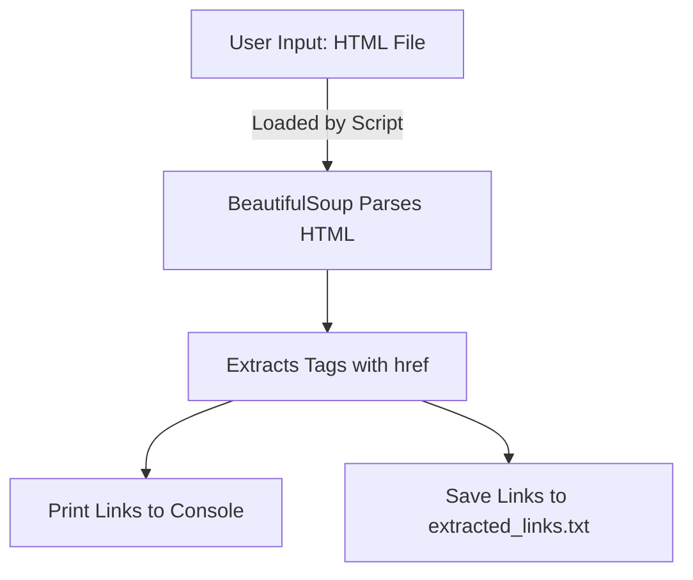

<h1 align="center">🔗 <a href="https://github.com/ronknight/html-link-extractor">HTML Link Extractor</a></h1>

<h4 align="center">📄 A Python-based tool to extract all hyperlinks from an HTML file using BeautifulSoup.</h4>

<p align="center">
  <a href="https://twitter.com/PinoyITSolution"></a>
  <a href="https://github.com/ronknight?tab=followers"></a>
  <a href="https://github.com/ronknight/html-link-extractor/stargazers"></a>
  <a href="https://github.com/ronknight/html-link-extractor/network/members"></a>
  <a href="https://youtube.com/@PinoyITSolution"></a>
  <a href="https://github.com/ronknight/html-link-extractor/issues"></a>
  <a href="https://github.com/ronknight/html-link-extractor/blob/master/LICENSE"></a>
  <a href="https://github.com/ronknight"></a>
</p>

<p align="center">
  <a href="#project-overview">Project Overview</a> •
  <a href="#installation">Installation</a> •
  <a href="#usage">Usage</a> •
  <a href="#visualization">Visualization</a> •
  <a href="#disclaimer">Disclaimer</a>
</p>

---

## 📘 Project Overview

HTML Link Extractor is a simple Python script that extracts all hyperlinks from an HTML file using the BeautifulSoup library. The extracted links are printed to the console and optionally saved to a text file for further use.

---

## 🛠️ Installation

1. **Clone the Repository**:
   ```bash
   git clone https://github.com/ronknight/html-link-extractor.git
   cd html-link-extractor
   ```

2. **Install Dependencies**:
   Ensure Python 3.x is installed on your system. Then, install the required library:
   ```bash
   pip install beautifulsoup4
   ```

---

## 🚀 Usage

1. Place your HTML file in the project directory. Rename it to `input.html` or adjust the file name in `app.py`.

2. Run the script:
   ```bash
   python app.py
   ```

3. Output:
   - Extracted links are displayed in the console.
   - A file named `extracted_links.txt` is created in the project directory containing the extracted links.

---

## 📊 Visualization



---

## ⚠️ Disclaimer

This tool is intended for educational purposes and does not validate or sanitize the extracted links. Use responsibly and ensure compliance with applicable laws and regulations when processing third-party HTML files.